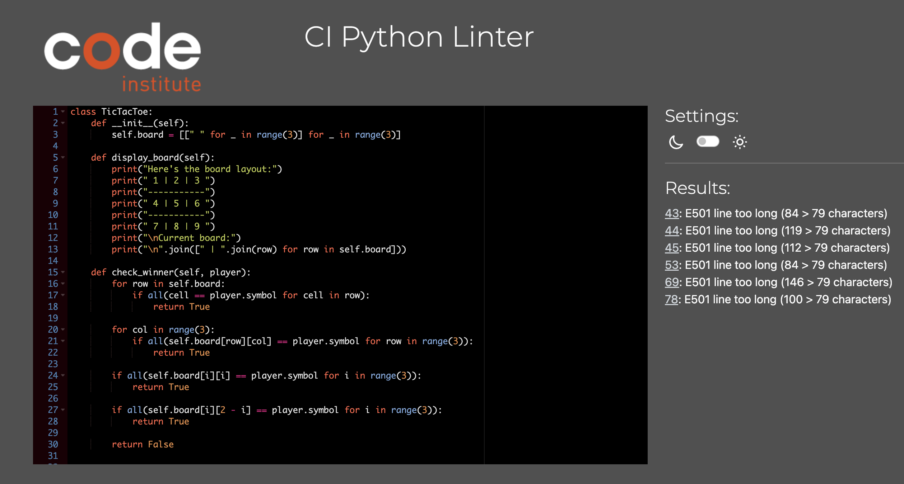

# TicTacToe Game 

The Tic-Tac-Toe game is a classic competition that challenges your strategic thinking and decision-making skills. As the name suggests, it's a game played on a 3x3 grid where players take turns placing their symbols, typically X or O, in an attempt to create a winning pattern.
This game offers a fun way to test your logical reasoning and pattern recognition abilities while providing an engaging and enjoyable experience. Whether you're looking to sharpen your skills or simply enjoy a casual game with friends, Tic-Tac-Toe offers a timeless and entertaining diversion.

Link for [TicTacToe Game](https://pt3-e82d74dd02fb.herokuapp.com/).

## Project Goals

The goal of the Tic-Tac-Toe game is to provide players with an entertaining and stimulating gaming experience. Tic-Tac-Toe is a classic game where two players take turns marking spaces on a 3x3 grid to form a row, column, or diagonal of their symbol, typically X or O.

The main objectives of the Tic-Tac-Toe game may include:

1. Entertainment: Offering players a fun and enjoyable way to spend their time. Tic-Tac-Toe provides a simple yet engaging gameplay experience that can be enjoyed by players of all ages.

2. Strategic Thinking: Encouraging players to think strategically and plan their moves to outsmart their opponent. The game requires players to anticipate their opponent's moves while planning their own to achieve victory.

3. Intellectual Challenge: Stimulating players' logical reasoning and critical thinking skills. Tic-Tac-Toe involves analyzing the game board and making decisions based on patterns and potential outcomes.

4. Social Interaction: Fostering social interaction and bonding between players. Whether played with friends, family, or strangers, Tic-Tac-Toe offers an opportunity for players to engage in friendly competition and enjoy each other's company.

Overall, the goal of the Tic-Tac-Toe game is to deliver a delightful and intellectually stimulating experience that entertains players while challenging their strategic thinking skills.

## Technologies

1. lucid.app - to create a flowchart.
2. Python - programming language used for the creation of the game.
3. VSCode - was used as the primary local IDE for coding.
4. GitHub - to store the project's code.
5. Heroku - to deploy my application.
### Strategy

1. Simplicity: The primary strategy for Tic-Tac-Toe is to keep the game simple and easy to understand. Players should quickly grasp the rules and gameplay mechanics without needing extensive instructions.

2. Engagement: The game aims to keep players engaged and entertained throughout the gameplay session. The interactive nature of Tic-Tac-Toe, where players take turns marking spaces on the grid, ensures continuous involvement.

3. Accessibility: Tic-Tac-Toe is designed to be accessible to players of all ages and skill levels. The straightforward grid layout and familiar gameplay mechanics make it easy for anyone to participate, regardless of their gaming experience.

4. Feedback: Providing immediate feedback to players is essential for a positive gaming experience. Tic-Tac-Toe offers clear feedback after each move, indicating whether the move was successful or not, and guiding players towards achieving victory.

### Scope

1. Gameplay Mechanics: The core gameplay mechanics of Tic-Tac-Toe revolve around players taking turns marking spaces on a 3x3 grid with their respective symbols (X or O) with the objective of achieving a winning combination. The scope of the game includes implementing these mechanics in an intuitive and engaging manner, ensuring smooth gameplay and clear instructions for players.

2. Visual Design: The visual design of Tic-Tac-Toe includes elements such as the grid layout and the symbols used by players to mark their moves. The scope encompasses creating a visually appealing and easily navigable interface that enhances the overall gaming 

### Structure

Since Tic-Tac-Toe is played on the command line interface, information is displayed to the players gradually based on their actions and requests.
At the start of the game, players are presented with an empty grid representing the game board. Each player takes turns marking spaces on the grid with their respective symbols (X or O). The objective is to create a horizontal, vertical, or diagonal line of three of their symbols.

When the game begins, the players only know the layout of the grid and the symbols they will be using. As the game progresses, they make their moves by entering the position where they want to place their symbol.

A successful move incurs no penalty. However, an unsuccessful move, such as attempting to mark a space that is already occupied, results in an error message prompting the player to choose a different position.

The game continues until one player successfully aligns three of their symbols in a row, column, or diagonal, or until the grid is fully filled without a winning combination, resulting in a tie.

Throughout the game, the players' actions and the state of the game board are displayed on the command line interface, allowing for an interactive and engaging gaming experience.

### Skeleton

To create a flowchart I used lucid.app.

### Surface

As Tic-Tac-Toe is a simple command-line game, the design aspect is minimal. The game primarily relies on text-based representations of the game board and player symbols. The game board is typically displayed as a grid of cells numbered from 1 to 9, representing the positions where players can place their symbols (X or O).

For example:

Players interact with the game by entering the number corresponding to the cell where they want to place their symbol. The game then updates the board to reflect the move and checks for a winning condition or a tie.

In terms of visual design, there are no intricate graphics or animations involved. The simplicity of the interface allows players to focus on the gameplay itself rather than being distracted by unnecessary visual elements.

## Testing

### Manual Testing

| Feature Tested                                 | Expected Outcome                                                                                            | Actual Outcome |
| ---------------------------------------------- | ----------------------------------------------------------------------------------------------------------- | -------------- |
| Start the game.                                | The game prompts players to enter their names and displays the game menu.                                   | As expected.   |
| Enter an invalid option in the menu.           | The program displays a message asking the player to enter a valid option.                                   | As expected.   |
| Select to start the game from the menu.        | The game begins and displays the Tic-Tac-Toe board.                                                         | As expected.   |
| Enter a number outside the range 1-9 as input. | The program displays a message asking the player to enter a valid position.                                 | As expected.   |
| Enter a position that is already occupied.     | The program displays a message indicating that the position is already taken and prompts for a new input. | As expected.   |
| Make a valid move.                             | The program updates the game board with the player's move.                                                  | As expected.   |
| Reach a winning condition.                     | The program displays a message declaring the current player as the winner.                                   | As expected.   |
| Fill all positions without a winner.           | The program displays a message declaring the game as a tie.                                                 | As expected.   |
| Choose to view the leaderboard.                | The program displays the leaderboard showing high scores.                                                   | As expected.   |
| Choose to read the rules.                      | The program displays the rules of the Tic-Tac-Toe game.                                                     | As expected.   |
| Choose to change the username.                 | The program prompts the player to enter a new username.                                                     | As expected.   |
| Enter a username that already exists.          | The program prompts the player to confirm if they want to resume their progress or start a new game.       | As expected.   |

### Python Validation

I validated my run.py file using [Code Institute's Python Linter](https://pep8ci.herokuapp.com/#).

## Deployment

### Create Repository

1. Link to the [Python Essentials Template](https://github.com/Code-Institute-Org/p3-template).
2. Click green button "Use this template", then "Create a new repository".
3. Enter repository name and click "Create repository".

### Cloning the Repository to VSCode
1. Start by navigating to my GitHub repository and click on the green button labeled "<> Code".
2. In the "HTTPS" tab, click on the clipboard icon to copy the repository's URL.
3.Open Visual Studio Code (VSCode) and press CTRL+SHIFT+G to open the Source Control view. Then, click on "Clone Repository" and paste the copied URL.
4. During development, I utilized the following git commands:
    - git add: To add file(s) to the staging area before committing changes.
    - git commit -m “commit message”: To commit changes to the local repository, preparing them for the final step.
    - git push: To push all committed code to the remote repository on GitHub.

### Deploying the Heroku App
The deployment of this project involved using Code Institute's mock terminal for Heroku. Below are the steps I followed to deploy the terminal to the website:

1. Create a new Heroku app on the Heroku website.
2. Set up config vars:
   - Navigate to the Settings tab and click on "Reveal Config Vars".
   - Add a new key named "CREDS" (in all capital letters) and paste the entire contents of the creds.json file from our workspace into the value field.
   - Click “Add”.
 3. Add another config var named "PORT" and set its value to "8000".
Add two buildpacks from the Settings tab, ensuring the correct ordering:
   - heroku/python
   - heroku/nodejs
 4. Connect the Heroku app to the GitHub repository.
 5. Enter the name of the repository, perform a search, and click on "Connect".
 6. Finally, click "Deploy Branch" to deploy the application.
 
## Credits

### Tutorials
Utilizing tutorials from YouTube has enriched my understanding of Python programming and enabled the creation of small games. For instance, by following the tutorial from [Programming with Mosh](https://www.youtube.com/watch?v=kqtD5dpn9C8&ab_channel=ProgrammingwithMosh), I learned how to develop a classic game involving guessing and programmatic player management. This tutorial helped grasp the game's logic and implement it step by step. Additionally, the video from [TechWithTim](https://www.youtube.com/watch?v=DLn3jOsNRVE&ab_channel=TechWithTim) offered an alternative perspective on creating similar games, enhancing my knowledge and skills in program development.

These tutorials provided foundational knowledge and practical skills for crafting mini-games in Python, expanding my programming capabilities.

Hangman Game Tutorial by Kevin Stratvert: Kevin Stratvert's tutorial offered another perspective on creating a Hangman game. His tutorial covered different aspects of game development and provided additional tips and tricks for improving the game.

### Online Resources
[W3Schools](https://www.w3schools.com/): W3Schools served as a comprehensive reference for HTML, CSS, and JavaScript, aiding in the development of user interfaces and interactive features for the Hangman game.
### ChatGPT
The ChatGPT model by OpenAI provided valuable assistance throughout the development process. Its ability to generate code snippets, provide explanations, and offer guidance on various programming concepts proved immensely helpful in resolving queries and refining game implementation.
